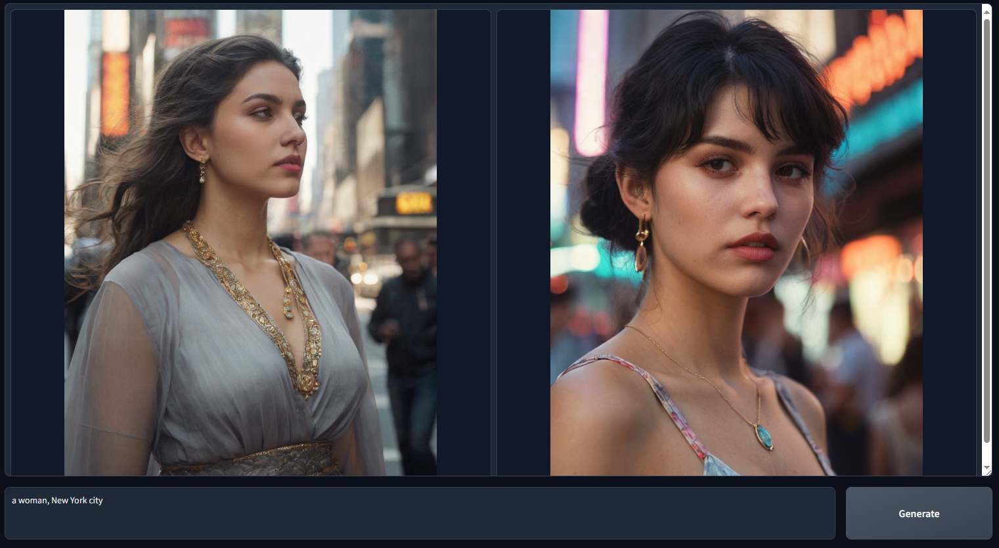

# GBICA VISION 🌹
<div align="center">




</div>

# GBICA VISION 🌹

**>>> [Click here to make your purchase ](https://www.instagram.com/charlotte.rlux) <<<**

GBICA VISION 🌹 is an offline, paid image generation software with fully secure and proprietary code. It focuses on ease of use: minimal setup, simple prompts, and high-quality results without complex tweaking.  

**Minimal GPU memory required: 4GB (Nvidia).**  

---

## Features

- High-quality text-to-image generation with minimal prompt engineering.
- Image-to-image transformations (Upscale, Variation, Inpaint, Outpaint).
- Advanced prompt processing with GPT-2-based engine.
- Support for multi-prompts, prompt weights, LoRAs, and wildcards.
- Multiple presets: Realistic, Anime, and Custom.
- Lightweight UI with offline operation.

---

## Download


## 🚀 Get GBICA VISION Now — Only $2!

Unlock the power of offline, secure, high-quality AI image generation with **GBICA VISION 🌹**!

### ✨ Why choose GBICA VISION?

- ✅ **One-time payment** — only $2 for lifetime access!  
- ✅ **Secure and proprietary code** — no hidden fees or subscriptions.  
- ✅ **Minimal setup** — download, install, and start creating in minutes.  
- ✅ **Simple prompts, amazing results** — no complex configurations needed.  

### 💳 How to purchase:

1. Click the link below to download.  
2. Contact our developer.  
3. Complete the secure $2 payment.  
4. Enjoy instant access to offline AI image generation!  

**>>> [Click here to make your purchase](https://www.instagram.com/charlotte.rlux) <<<**  

🌹 Transform your creativity today — effortlessly.

### compatible with
🪟 Windows

🐧 Linux

🍎 macOS (Apple Silicon M1/M2)

🐋 Docker

☁️ Google Colab

## Minimal Requirement

Below is the minimal requirement for running GBICA VISION 🌹 locally. If your device capability is lower than this spec, you may not be able to use Fooocus locally. (Please let us know, in any case, if your device capability is lower but Fooocus still works.)

| Operating System  | GPU                          | Minimal GPU Memory           | Minimal System Memory     | [System Swap](troubleshoot.md) | Note                                                                       |
|-------------------|------------------------------|------------------------------|---------------------------|--------------------------------|----------------------------------------------------------------------------|
| Windows/Linux     | Nvidia RTX 4XXX              | 4GB                          | 8GB                       | Required                       | fastest                                                                    |
| Windows/Linux     | Nvidia RTX 3XXX              | 4GB                          | 8GB                       | Required                       | usually faster than RTX 2XXX                                               |
| Windows/Linux     | Nvidia RTX 2XXX              | 4GB                          | 8GB                       | Required                       | usually faster than GTX 1XXX                                               |
| Windows/Linux     | Nvidia GTX 1XXX              | 8GB (&ast; 6GB uncertain)    | 8GB                       | Required                       | only marginally faster than CPU                                            |
| Windows/Linux     | Nvidia GTX 9XX               | 8GB                          | 8GB                       | Required                       | faster or slower than CPU                                                  |
| Windows/Linux     | Nvidia GTX < 9XX             | Not supported                | /                         | /                              | /                                                                          |
| Windows           | AMD GPU                      | 8GB    (updated 2023 Dec 30) | 8GB                       | Required                       | via DirectML (&ast; ROCm is on hold), about 3x slower than Nvidia RTX 3XXX |
| Linux             | AMD GPU                      | 8GB                          | 8GB                       | Required                       | via ROCm, about 1.5x slower than Nvidia RTX 3XXX                           |
| Mac               | M1/M2 MPS                    | Shared                       | Shared                    | Shared                         | about 9x slower than Nvidia RTX 3XXX                                       |
| Windows/Linux/Mac | only use CPU                 | 0GB                          | 32GB                      | Required                       | about 17x slower than Nvidia RTX 3XXX                                      |

&ast; AMD GPU ROCm (on hold): The AMD is still working on supporting ROCm on Windows.

&ast; Nvidia GTX 1XXX 6GB uncertain: Some people report 6GB success on GTX 10XX, but some other people report failure cases.

*Note that Fooocus is only for extremely high quality image generating. We will not support smaller models to reduce the requirement and sacrifice result quality.*


### All CMD Flags

```
entry_with_update.py  [-h] [--listen [IP]] [--port PORT]
                      [--disable-header-check [ORIGIN]]
                      [--web-upload-size WEB_UPLOAD_SIZE]
                      [--hf-mirror HF_MIRROR]
                      [--external-working-path PATH [PATH ...]]
                      [--output-path OUTPUT_PATH]
                      [--temp-path TEMP_PATH] [--cache-path CACHE_PATH]
                      [--in-browser] [--disable-in-browser]
                      [--gpu-device-id DEVICE_ID]
                      [--async-cuda-allocation | --disable-async-cuda-allocation]
                      [--disable-attention-upcast]
                      [--all-in-fp32 | --all-in-fp16]
                      [--unet-in-bf16 | --unet-in-fp16 | --unet-in-fp8-e4m3fn | --unet-in-fp8-e5m2]
                      [--vae-in-fp16 | --vae-in-fp32 | --vae-in-bf16]
                      [--vae-in-cpu]
                      [--clip-in-fp8-e4m3fn | --clip-in-fp8-e5m2 | --clip-in-fp16 | --clip-in-fp32]
                      [--directml [DIRECTML_DEVICE]]
                      [--disable-ipex-hijack]
                      [--preview-option [none,auto,fast,taesd]]
                      [--attention-split | --attention-quad | --attention-pytorch]
                      [--disable-xformers]
                      [--always-gpu | --always-high-vram | --always-normal-vram | --always-low-vram | --always-no-vram | --always-cpu [CPU_NUM_THREADS]]
                      [--always-offload-from-vram]
                      [--pytorch-deterministic] [--disable-server-log]
                      [--debug-mode] [--is-windows-embedded-python]
                      [--disable-server-info] [--multi-user] [--share]
                      [--preset PRESET] [--disable-preset-selection]
                      [--language LANGUAGE]
                      [--disable-offload-from-vram] [--theme THEME]
                      [--disable-image-log] [--disable-analytics]
                      [--disable-metadata] [--disable-preset-download]
                      [--disable-enhance-output-sorting]
                      [--enable-auto-describe-image]
                      [--always-download-new-model]
                      [--rebuild-hash-cache [CPU_NUM_THREADS]]
```


After download, extract the file and run `run.bat` (or `run_anime.bat` / `run_realistic.bat` for different presets). The software will download the required models automatically.  

> Minimal requirements: 4GB GPU, 8GB RAM.  

---

## Default Models

| Task      | Preset File | Main Model                  |
|-----------|-------------|-----------------------------|
| General   | run.bat     | juggernautXL_v8Rundiffusion |
| Realistic | run_realistic.bat | realisticStockPhoto_v20     |
| Anime     | run_anime.bat | animaPencilXL_v500          |

Models are automatically downloaded on first run.

---

## Troubleshoot

- If you see `MetadataIncompleteBuffer` or `PytorchStreamReader` errors, re-download models.  
- Ensure enough free disk space (40GB recommended).  

---

## Thanks

 thanks to the founder   [Luizbic](https://github.com/Luizbic)
